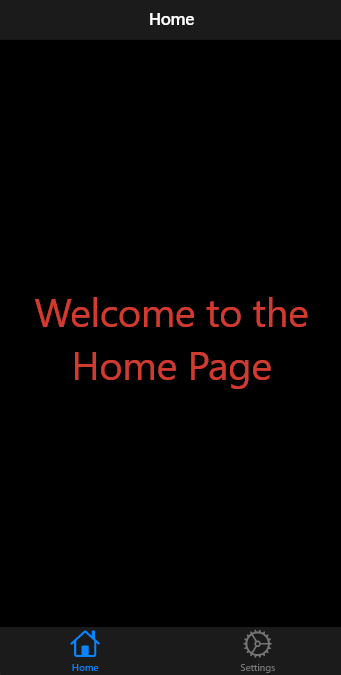

# Flutter Provider Demo

<p align="center">
  
</p>

## Description

Ce projet est une application Flutter démontrant l'utilisation du package Provider pour gérer l'état d'une application. Il comprend deux pages : une page d'accueil affichant un message de bienvenue et une page de paramètres où l'utilisateur peut entrer son nom d'utilisateur.

## Fonctionnalités

- Page d'accueil affichant un message de bienvenue dynamique.
- Page de paramètres avec un champ de texte pour saisir un nom d'utilisateur.
- Utilisation de Provider pour la gestion d'état.
- Design réactif adapté aux différentes tailles d'écran.

## Installation

1. Clonez le dépôt :

   ```bash
   git clone https://github.com/alexyvanot/flutter_provider_demo/
   ```

2. Accédez au répertoire du projet :

   ```bash
   cd flutter_provider_demo
   ```
   
3. Installez les dépendances :

   ```bash
   flutter pub get
   ```

4. Exécutez l'application :

   ```bash
   flutter run
   ```

## Utilisation

1. À l'ouverture de l'application, vous serez redirigé vers la page d'accueil, qui affichera un message de bienvenue par défaut.

2. Pour changer le nom d'utilisateur, naviguez vers la page **Settings** (Paramètres) en appuyant sur l'icône des paramètres dans la barre de navigation en bas.

3. Dans la page de paramètres, entrez votre nom d'utilisateur dans le champ de texte et appuyez sur le bouton **OK**.

4. Revenez à la page d'accueil pour voir votre nom d'utilisateur s'afficher dans le message de bienvenue.
